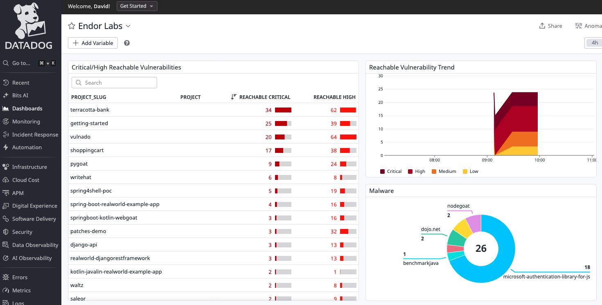

# endorlabs-datadog-bridge

Send [Endor Labs](https://www.endorlabs.com/) reachable vulnerability and malware findings to [Datadog](https://www.datadoghq.com/) as structured logs.



## How it works

1. Authenticates with the Endor Labs API (API key/secret or bearer token).
2. Queries all projects in the given namespace for reachable vulnerability counts (by severity) and malware findings.
3. Sends one log entry per project to Datadog with all counts as structured attributes.

Each log entry contains the following attributes:

| Attribute | Description |
|-----------|-------------|
| `project_url` | Direct link to the project in the Endor Labs UI (clickable in Log Explorer) |
| `project_slug` | Short repository name extracted from the project URL |
| `critical_count` | Reachable critical vulnerabilities |
| `high_count` | Reachable high vulnerabilities |
| `medium_count` | Reachable medium vulnerabilities |
| `low_count` | Reachable low vulnerabilities |
| `malware_count` | Malware findings |

Logs are tagged with `source:endorlabs` and `service:endorlabs-bridge`.

## Setup

### Prerequisites

- Node.js 22+
- npm

### Install

```bash
npm ci
```

### Configuration

Copy the example env file and fill in your values:

```bash
cp .env.example .env
```

| Variable | Required | Description |
|----------|----------|-------------|
| `DD_API_KEY` | Yes | Datadog API key |
| `ENDOR_NAMESPACE` | Yes | Endor Labs namespace |
| `DD_SITE` | No | Datadog site (e.g. `datadoghq.com`, `datadoghq.eu`) |
| `ENDOR_API` | No | Endor Labs API base URL (default: `https://api.endorlabs.com`) |
| `ENDOR_TOKEN` | No | Endor Labs bearer token |
| `ENDOR_API_KEY` | No | Endor Labs API key |
| `ENDOR_API_SECRET` | No | Endor Labs API secret |

Either `ENDOR_TOKEN` **or** both `ENDOR_API_KEY` and `ENDOR_API_SECRET` must be provided.

### Run

```bash
# Development (runs TypeScript directly via tsx)
npm run dev

# Production (compile first, then run)
npm run build
npm start
```

## GitHub Actions

A workflow is included at `.github/workflows/sync.yml` that runs the sync on an hourly schedule and supports manual dispatch.

The workflow expects the same variables from your `.env` file to be stored as repository secrets. If you have the [GitHub CLI](https://cli.github.com/) installed, you can push them all at once:

```bash
npm run setup:secrets
```

This reads every key/value pair from `.env` and calls `gh secret set` for each one.

## Example Dashboard

An importable Datadog dashboard template is provided at [`example/dashboard.json`](example/dashboard.json). It includes:

- **Critical/High Reachable Vulnerabilities** — table sorted by critical and high counts. Click a row to open the project in Endor Labs via the `project_url` attribute.
- **Reachable Vulnerability Trend** — time series broken down by severity.
- **Malware** — sunburst chart of malware counts by project.

To import: in Datadog, go to **Dashboards > New Dashboard > Import Dashboard JSON** and paste the contents of the file.

### Creating facets and measures

The dashboard widgets query log attributes that must be registered as facets or measures in Datadog before they become available. After the first sync run:

1. Go to **Logs > Search** and filter by `source:endorlabs`.
2. Expand any log entry and click on each attribute listed below.
3. Select **Create facet** and set the type as shown.

| Attribute | Type |
|-----------|------|
| `@project_slug` | Facet (string) |
| `@project_url` | Facet (string) |
| `@critical_count` | Measure (integer) |
| `@high_count` | Measure (integer) |
| `@medium_count` | Measure (integer) |
| `@low_count` | Measure (integer) |
| `@malware_count` | Measure (integer) |

Facets and measures only apply to logs received **after** creation. Run the sync again once all measures are in place so the dashboard has queryable data.

## License

[MIT](LICENSE)
